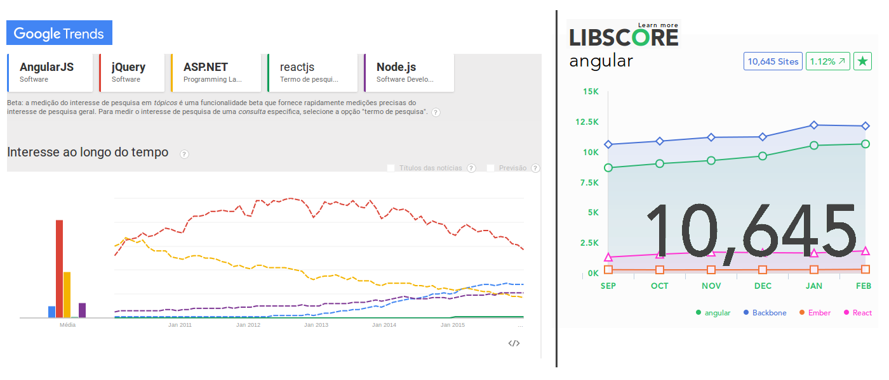
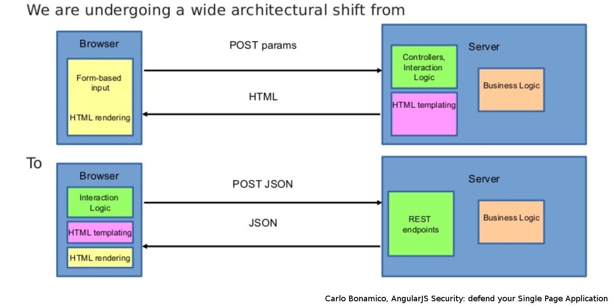

# Script Wars
------


### hands-on introduction


https://github.com/AngularPortugal/script-wars

->
## What is angular.js?
- Client-side JS MVC framework

- Created by Misko Hevery around 2009

- Original release 0.9.0 Oct 20, 2010

- Written to be fast to develop and easily testable

- MIT license

->
## Why use MVC
- Team specialization

- Quick changes

- Reusable API

->
## Why Angular
- Quick prototyping

- Strong split between markup and controlers (Designer JS free)

- Reusable components

- "Templification" using HTML parts


->
## Hello Angular.JS
```html
<!doctype html>
<html ng-app>
<head>
    <script src="https://ajax.googleapis.com/ajax/libs/angularjs/1.5.0/angular.min.js">script>
</head>
<body>
    <div>
        <label>Name:</label>
        <input type="text" ng-model="yourName" placeholder="Enter a name here">
        <hr>
        <h1>Hello {{yourName}}!</h1>
    </div>
</body>
</html>
```

->
## Version confusion
- Versions 1.3 and later => IE 9+

- Current stable release is 1.5

- Angular 2 was announced at ng-europe September 2014

- Angular 2 is a complete rewrite

- Angular 2 went beta in December 2015

->
## Some numbers



->
## More numbers on GitHub

#### Angular.js
###  46.738 Stars &nbsp;&nbsp;&nbsp;&nbsp; 21.726 Forks

#### React
###  35.981 Stars &nbsp;&nbsp;&nbsp;&nbsp; 5.876 Forks


->
## SPA Architecture



->
## Main features
- Complete application framework

- Two way data binding

- MVC / MV-Whatever structure

- Directives (declarative DOM)

- Dependency injection

- Promises

- Routing

- Testing

->


->
### links
------
- https://angularjs.org/

->
# questions?

->
# thank you!

github.com/revaristo

github.com/vmlf01
